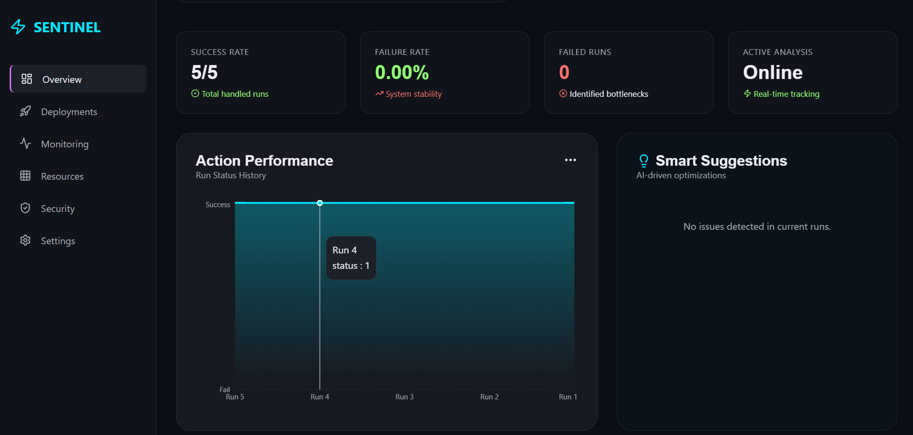
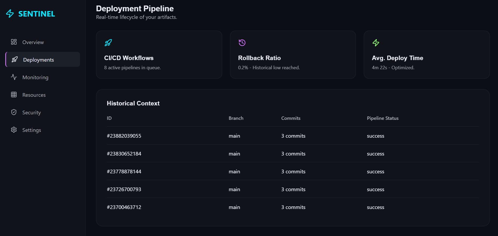
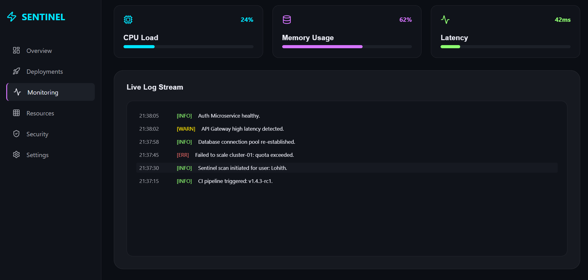
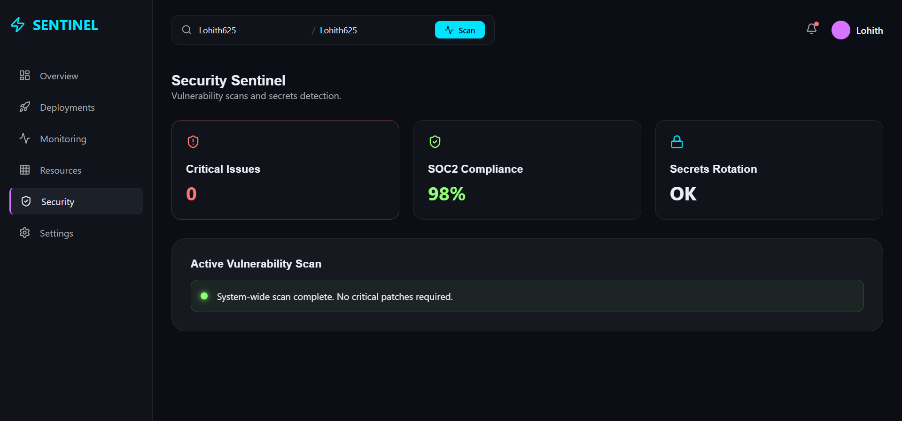

# ⚡ Sentinel — DevOps Intelligence Dashboard

🚀 Real-time CI/CD Pipeline Analyzer • 📊 Smart Insights • ⚙️ DevOps Monitoring


---

## 🚀 Overview

**Sentinel** is a full-stack DevOps Intelligence platform that analyzes GitHub Actions pipelines and provides **real-time insights, failure detection, and smart suggestions** to improve CI/CD performance.

It transforms raw pipeline data into **actionable insights**, helping developers debug faster and optimize workflows efficiently.

---

## ✨ Features

* 🔍 Analyze GitHub Actions pipelines
* 📉 Detect failing steps (Push, Install, Test, etc.)
* 🧠 Smart suggestions for fixing pipeline issues
* 📊 Visual dashboard with charts & metrics
* ⚡ Real-time CI/CD monitoring UI
* 🔐 Secure GitHub token integration (env-based)

---

## 📸 Screenshots

> Replace these placeholders with your images

### 🖥 Dashboard



### 🚀 Deployments



### 📡 Monitoring



### ☁️ Resources


### 🔐 Security



---

## 🏗 Tech Stack

### 🔹 Frontend

* React.js
* Recharts
* CSS (Custom Dark UI)
* Axios

### 🔹 Backend

* Node.js
* Express.js
* Axios
* GitHub REST API

---

## 📂 Project Structure

```text
devops-intelligence/
│
├── backend/
│   ├── server.js
│   └── package.json
│
├── frontend/
│   ├── src/
│   └── package.json
│
└── README.md
```

---

## ⚙️ Setup Instructions

### 1️⃣ Clone the Repository

```bash
git clone https://github.com/Lohith625/devops-intelligence.git
cd devops-intelligence
```

### 2️⃣ Backend Setup

```bash
cd backend
npm install
```

Create a `.env` file:

```env
GITHUB_TOKEN=your_token_here
```

Run the backend:

```bash
node server.js
```

### 3️⃣ Frontend Setup

```bash
cd frontend
npm install
npm start
```

---

## 🔑 How It Works

1. User enters GitHub repository details
2. Backend fetches GitHub Actions data
3. System analyzes:

   * Failed steps
   * Pipeline trends
4. Dashboard displays:

   * Failure insights
   * Smart suggestions
   * Performance metrics

---

## 📊 Key Highlights

* 📈 Real-time CI/CD pipeline analysis
* ⚡ Step-level failure detection
* 🧠 Logic-based troubleshooting engine
* 🎯 Actionable DevOps insights
* 🔄 Scalable full-stack architecture

---

## 🚀 Future Improvements

* 🔐 OAuth GitHub login (no manual token)
* 🌐 Multi-repository support
* ☁️ Deployment monitoring (AWS, Kubernetes)
* 📊 Advanced analytics and anomaly detection

---

## 🌐 Deployment

🚧 Coming soon

* Backend → Railway / Render
* Frontend → Vercel

---

## 👨‍💻 Author

**Lohith M**
Backend Engineer | DevOps Enthusiast

---

## ⭐ Support

If you like this project, give it a ⭐ on GitHub!
